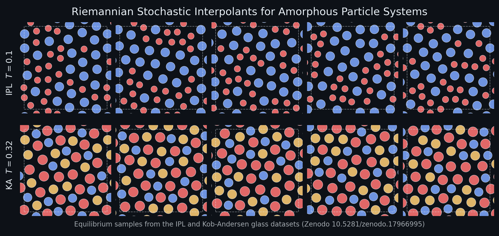

# Riemannian Stochastic Interpolants for Amorphous Particle Systems



Reference implementation of

> **Riemannian Stochastic Interpolants for Amorphous Particle Systems**
> Louis Grenioux, Leonardo Galliano, Ludovic Berthier, Giulio Biroli, Marylou Gabrié
> [arXiv:2512.16607](https://arxiv.org/abs/2512.16607)

We learn generative flows that sample equilibrium configurations of glass-forming
materials &mdash; disordered, multi-component particle systems on a periodic box.
The training objective is a *Riemannian* stochastic interpolant on the flat torus,
parameterized by an equivariant graph neural network that respects the symmetries of
the system (periodicity, permutations within species, axis reflections / swaps).
The companion dataset of Monte-Carlo equilibrium samples used for training is
released on Zenodo: [10.5281/zenodo.17966995](https://doi.org/10.5281/zenodo.17966995).


## Installation

```bash
git clone <repo-url> learndiffeq
cd learndiffeq
python -m venv venv && source venv/bin/activate
pip install -e .
```

Python &ge; 3.9, PyTorch and PyTorch Lightning. The full dependency list lives in
[`requirements.txt`](requirements.txt).


## Datasets

The training datasets are equilibrium samples produced by long Metropolis&ndash;Hastings
chains for two glass-forming systems:

| System | Particles | Species | Temperatures | Source |
|---|---|---|---|---|
| Inverse Power Law (IPL / BHHP soft spheres) | 10, 44 | 2 | 0.04, 0.07, 0.1 | [Zenodo 17966995](https://zenodo.org/records/17966995) |
| Kob&ndash;Andersen (KA) ternary mixture | 44 | 3 | 0.32, 1.0 | [Zenodo 17966995](https://zenodo.org/records/17966995) |

Each `<name>_positions.pt` file is a `(100000, N, 2)` tensor of particle coordinates
and the matching `<name>_species.pt` is a `(100000, N)` integer tensor of species
labels. Download whichever splits you need from the Zenodo record above, for
example:

```bash
mkdir -p datasets
curl -L -o datasets/ipl44_T0.1_positions.pt \
  "https://zenodo.org/records/17966995/files/ipl44_T0.1_positions.pt?download=1"
curl -L -o datasets/ipl44_T0.1_species.pt \
  "https://zenodo.org/records/17966995/files/ipl44_T0.1_species.pt?download=1"
```


## Training

The canonical entry point is [`experiments/training_rfm.py`](experiments/training_rfm.py),
which trains a Riemannian flow matching (`rfm`), Euclidean flow matching (`fm`) or
maximum-likelihood (`ml`) model on one of the Zenodo datasets. A representative run
on the IPL-44 system at $T = 0.1$:

```bash
python experiments/training_rfm.py \
    --savename ipl44_rfm_egnn \
    --results_path results \
    --target_type bhhp \
    --base_type uniform \
    --dataset_filepath datasets/ipl44_T0.1_positions.pt \
    --species_filepath datasets/ipl44_T0.1_species.pt \
    --temp 0.1 \
    --training_algo rfm \
    --velocity_type particles_equivariant \
    --egnn_hidden_nf 32 --egnn_n_layers 3 \
    --batch_size 256 --n_epochs 1250 --lr 1e-3 \
    --use_data_aug --use_ema \
    --enable_ess_callback
```

Useful flags:

* `--target_type {bhhp,kba}` selects the soft-sphere (IPL) or Kob&ndash;Andersen energy.
* `--training_algo {rfm,fm,ml}` switches between Riemannian flow matching, classical
  flow matching and the maximum-likelihood ODE objective.
* `--velocity_type` chooses the network: `particles_equivariant` (toroidal EGNN),
  `mlp,128,128,128`, `mlp_no_angle`, etc.
* `--use_data_aug` augments each epoch with the symmetry group of the system
  (intra-species permutations, random translations on the torus, axis swaps and sign
   flips). See `apply_augmentation_parameters` in `training_rfm.py`.
* `--use_ema` enables exponential moving averages of the network weights.
* `--enable_ess_callback` periodically logs the importance-sampling Effective Sample
  Size against the Boltzmann distribution.

Lightning checkpoints land in `<results_path>/checkpoints/<savename>/` and
TensorBoard logs in `<results_path>/<savename>/`.


## Repository layout

```
learndiffeq/
├── common/                 # LearnODE base class, datamodules, ODE solvers
├── flow_matching/          # Riemannian and Euclidean flow matching
├── ml/                     # Maximum-likelihood ODE training
├── interpolants/           # Stochastic-interpolant probability paths
├── velocities/             # MLP / score-based velocity networks
├── particles/
│   ├── distributions/      # KobAndersen, SoftSphere, Lennard-Jones, Uniform, ...
│   ├── velocities/         # Equivariant EGNN on the torus
│   ├── callbacks/          # Marginal histograms, ESS diagnostics
│   └── utils.py            # OT / linear-assignment pairings, species utilities
├── callbacks/              # EMA weight averaging, gradient-norm tracking, ...
└── distributions/          # 2-D toy distributions (Gaussians, moons, spirals)
experiments/
├── training_rfm.py         # Main training entry point (described above)
├── 8_gaussians.py
└── 8_gaussians_to_moons.py
```


## Citation

```bibtex
@article{grenioux2025riemannian,
  title  = {Riemannian Stochastic Interpolants for Amorphous Particle Systems},
  author = {Grenioux, Louis and Galliano, Leonardo and Berthier, Ludovic and
            Biroli, Giulio and Gabri{\'e}, Marylou},
  journal= {arXiv preprint arXiv:2512.16607},
  year   = {2025}
}

@dataset{grenioux2025dataset,
  title  = {Equilibrium samples from Inverse Power Law and Kob-Andersen glassy systems},
  author = {Grenioux, Louis and Galliano, Leonardo and Berthier, Ludovic and
            Biroli, Giulio and Gabri{\'e}, Marylou},
  year   = {2025},
  doi    = {10.5281/zenodo.17966995},
  url    = {https://zenodo.org/records/17966995}
}
```
